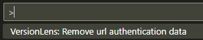

# Authorization

Version lens has an interactive worflow for authorizing packages that respond with 401 status codes and stores the [url authentication data](./authorization.md#url-authentication-data) data per workspace.

Supported authentication types are
- Basic Auth (prompts for a username and password)
- Custom (prompts for a custom authentication value)
- Microsoft (vscode built-in provider)
- Github (vscode built-in provider)

> **NOTE**
>
> - Doesn't support multiple authentications for the same domain
> - Doesn't work with Npm because npm uses npmrc files to authorize requests

## Url Authentication Data

### How your data is stored

  - Credentials are stored in the [ExtensionContext.secrets](https://code.visualstudio.com/api/extension-capabilities/common-capabilities#data-storage) storage

  - Non-sensitive authentication info (per url) is stored in the [ExtensionContext.workspaceState](https://code.visualstudio.com/api/extension-capabilities/common-capabilities#data-storage) storage (e.g. unique per workspace).<br> Use `versionlens.authorization.removeUrlAuthentication` to clear authentication info

### What data is stored

```js
{
  url: string
  protocol: string
  id: string
  label: string
  scheme: AuthenticationScheme
  isCustomProvider: boolean
}
```

### Clearing Url Authentication Data

To clear credentials

- Press `ctrl+p` then type `Remove url authentication data`.

  

- Choose the url(s) you want to clear and press `ok`

  > **NOTE**
  >
  > If you have a project\package file opened when running these steps and one of your packages need re-authorization with the same url then you will be prompted to re-enter authorization (if you dismiss this prompt then the url will need to be cleared again)