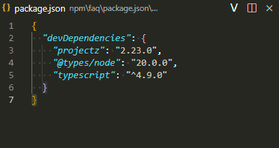
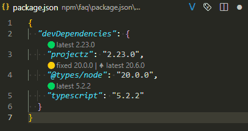
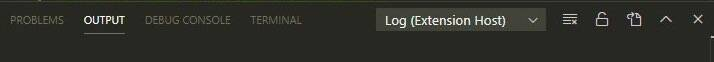
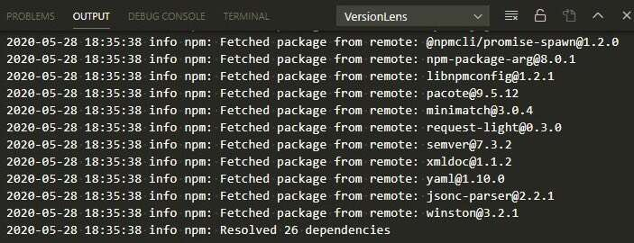

# VersionLens Redux for Visual Studio Code

VersionLens Redux shows dependency versions, update actions, and vulnerability diagnostics in VS Code manifest files.

[](https://github.com/xsyetopz/versionlens-redux/actions/workflows/vscode.yml)
[](https://github.com/xsyetopz/versionlens-redux/releases)
[](../../LICENSE)



## Extension identity

- Extension name: `versionlens-redux`
- Publisher: `xsyetopz`
- VS Code id: `xsyetopz.versionlens-redux`
- Original extension id checked for conflicts: `pflannery.vscode-versionlens`

When the original VersionLens extension is installed, VersionLens Redux warns and offers to disable the original extension. Running both extensions at the same time can duplicate CodeLens providers and commands.

## Features

- CodeLens hints for installed, latest, constrained, fixed, and prerelease versions.
- Update commands for latest, major, minor, and patch targets.
- Manifest-aware dependency sorting where ordering is safe.
- OSV.dev vulnerability diagnostics for ecosystems supported by OSV.
- Registry, prerelease, file-pattern, HTTP, and authentication settings per provider.
- Cache clearing and optional custom install command on save.

## Supported manifests

VersionLens Redux scans dependency files across these ecosystems:

| Area | Manifests and sources |
| --- | --- |
| JavaScript and web | npm, Bun, pnpm, JSPM, Deno, JSR, Unity Package Manager |
| Rust, Go, Swift, Zig, Nim, D, Haxe | Cargo, Go modules, Swift Package Manager, Zig package URLs, Nimble, Dub, Haxelib |
| .NET and JVM | NuGet, Paket, Maven, Gradle/Kotlin DSL-related dependency files where parser support exists |
| C and C++ | Conan, CMake `FetchContent` / `ExternalProject` / CPM calls, Xmake `add_requires`, Meson wraps, Bazel workspace dependencies, vcpkg |
| Containers and infrastructure | Dockerfiles, Compose files, OCI image references, Terraform/OpenTofu, Helm, Kustomize, Nix flakes, Ansible Galaxy, Bazel/Bzlmod |
| Scripting and application ecosystems | Composer, CPAN, PyPI, RubyGems, Pub, LuaRocks, Julia, CRAN, CocoaPods, opam, Hackage, Stack, Cabal, Hex |

TOML support requires a VS Code TOML language extension such as Even Better TOML.

## Manifest coverage

| Provider | Files | Main settings | Registry/source |
| --- | --- | --- | --- |
| Cargo | Cargo.toml | `versionlens.cargo.files`, `versionlens.cargo.apiUrl`, `versionlens.cargo.dependencyProperties` | crates.io index/API or configured Cargo registry |
| Composer | composer.json | `versionlens.composer.files`, `versionlens.composer.apiUrl`, `versionlens.composer.dependencyProperties` | Packagist or configured Composer repository |
| Deno | deno.json, deno.jsonc, import_map.json, jsr.json, jsr.jsonc | `versionlens.deno.files`, `versionlens.deno.dependencyProperties` | Deno import maps, JSR API, npm registry for npm: specifiers |
| Docker | dockerfile, Dockerfile, compose.yaml, compose.yml, docker-compose.yaml, docker-compose.yml | `versionlens.docker.files` | OCI/Docker registry tags |
| .NET | project.json, Directory.Packages.props, packages.config, paket.dependencies, paket.references | `versionlens.dotnet.files`, `versionlens.dotnet.dependencyProperties` | NuGet v3 service index or configured NuGet/Paket source |
| Dub | dub.json, dub.selections.json, dub.sdl | `versionlens.dub.files`, `versionlens.dub.apiUrl`, `versionlens.dub.dependencyProperties` | Dub registry API |
| Go | go.mod, go.work | `versionlens.golang.files`, `versionlens.golang.apiUrl` | Go module proxy |
| Hex | mix.exs, rebar.config, gleam.toml | `versionlens.hex.files`, `versionlens.hex.apiUrl`, `versionlens.hex.dependencyProperties` | Hex package API or configured Hex-compatible registry |
| Maven | pom.xml, build.gradle, build.gradle.kts, settings.gradle, settings.gradle.kts, gradle/libs.versions.toml, build.sbt, deps.edn, project.clj | `versionlens.maven.files`, `versionlens.maven.apiUrl`, `versionlens.maven.dependencyProperties` | Maven Central, Gradle Plugin Portal, configured Maven repositories, and Clojars |
| npm | package.json, package.json5, package.yaml, package.yml | `versionlens.npm.files`, `versionlens.npm.dependencyProperties` | npm registry or configured npm-compatible registry |
| pnpm | pnpm-workspace.yaml, pnpm-workspace.yml, .yarnrc.yaml, .yarnrc.yml | `versionlens.pnpm.files`, `versionlens.pnpm.dependencyProperties` | npm registry through pnpm/Yarn workspace configuration |
| Pub | pubspec.yaml, pubspec.yml, pubspec_overrides.yaml | `versionlens.pub.files`, `versionlens.pub.apiUrl`, `versionlens.pub.dependencyProperties` | pub.dev API or hosted Pub source |
| Python | Pipfile, pyproject.toml | `versionlens.pypi.files`, `versionlens.pypi.apiUrl`, `versionlens.pypi.dependencyProperties` | PyPI JSON API or configured Python package index/source |
| Ruby | Gemfile | `versionlens.ruby.files`, `versionlens.ruby.apiUrl` | RubyGems API or Bundler source |
| opam | opam, dune-project | `versionlens.opam.files`, `versionlens.opam.apiUrl`, `versionlens.opam.dependencyProperties` | opam package pages from opam.ocaml.org or configured opam package site |
| Haskell | cabal.project, stack.yaml, stack.yml | `versionlens.hackage.files`, `versionlens.hackage.apiUrl`, `versionlens.hackage.dependencyProperties` | Hackage package API, Stackage snapshots API, and Stack extra-deps package index entries |
| Julia | Project.toml, Manifest.toml, Manifest-v{major}.{minor}.toml | `versionlens.julia.files`, `versionlens.julia.apiUrl`, `versionlens.julia.dependencyProperties` | Julia General registry Versions.toml files or configured Julia registry base URL |
| CRAN | DESCRIPTION, renv.lock | `versionlens.cran.files`, `versionlens.cran.apiUrl`, `versionlens.cran.dependencyProperties` | CRAN PACKAGES metadata from CRAN or configured CRAN-like repositories |
| Conan | conanfile.txt, conanfile.py | `versionlens.conan.files`, `versionlens.conan.apiUrl`, `versionlens.conan.dependencyProperties` | Conan v2 registry search API from ConanCenter or configured Conan-compatible remotes |
| C/C++ build files | CMakeLists.txt, *.cmake, xmake.lua, subprojects/*.wrap, WORKSPACE, WORKSPACE.bazel | `versionlens.cpp.files`, `versionlens.cpp.apiUrl`, `versionlens.cpp.dependencyProperties` | GitHub tags for GitHub-backed CMake, Meson wrap, and Bazel dependencies; Xmake package recipes from xmake-repo for Xmake dependencies |
| vcpkg | vcpkg.json | `versionlens.vcpkg.files`, `versionlens.vcpkg.apiUrl`, `versionlens.vcpkg.dependencyProperties` | vcpkg registry version database from the configured registry repository |
| Swift | Package.swift | `versionlens.swift.files`, `versionlens.swift.apiUrl`, `versionlens.swift.dependencyProperties` | Swift package registry API or GitHub tags for GitHub URL dependencies |
| Zig | build.zig.zon | `versionlens.zig.files`, `versionlens.zig.apiUrl`, `versionlens.zig.dependencyProperties` | Zig package URLs with GitHub tag lookup for GitHub-hosted archives |
| Nim | .nimble | `versionlens.nim.files`, `versionlens.nim.apiUrl`, `versionlens.nim.dependencyProperties` | Nimble packages index with GitHub tag lookup for GitHub URL dependencies |
| LuaRocks | .rockspec | `versionlens.luarocks.files`, `versionlens.luarocks.apiUrl`, `versionlens.luarocks.dependencyProperties` | LuaRocks manifest repository |
| CPAN | cpanfile | `versionlens.cpan.files`, `versionlens.cpan.apiUrl`, `versionlens.cpan.dependencyProperties` | MetaCPAN download_url API |
| Haxelib | haxelib.json | `versionlens.haxelib.files`, `versionlens.haxelib.apiUrl`, `versionlens.haxelib.dependencyProperties` | Haxelib project versions page |
| Terraform | *.tf, *.tofu | `versionlens.terraform.files`, `versionlens.terraform.apiUrl`, `versionlens.terraform.dependencyProperties` | Terraform Registry protocol |
| Helm | Chart.yaml | `versionlens.helm.files`, `versionlens.helm.apiUrl`, `versionlens.helm.dependencyProperties` | Helm chart repository index.yaml and OCI tags |
| Ansible | requirements.yml, requirements.yaml | `versionlens.ansible.files`, `versionlens.ansible.apiUrl`, `versionlens.ansible.dependencyProperties` | Ansible Galaxy API for collections and roles; git/source requirements are fixed |
| Bazel | MODULE.bazel | `versionlens.bazel.files`, `versionlens.bazel.apiUrl`, `versionlens.bazel.dependencyProperties` | Bazel Central Registry metadata.json or configured Bazel registry |
| Nix | flake.nix | `versionlens.nix.files`, `versionlens.nix.apiUrl`, `versionlens.nix.dependencyProperties` | GitHub repository tags for GitHub-backed Nix flake inputs; local/path/git follows are fixed |
| Kustomize | kustomization.yaml, kustomization.yml, Kustomization | `versionlens.kustomize.files`, `versionlens.kustomize.dependencyProperties` | Docker Hub and OCI-compatible registries through image tag lookup |
| Unity | Packages/manifest.json | `versionlens.unity.files`, `versionlens.unity.apiUrl`, `versionlens.unity.dependencyProperties` | Unity npm-compatible package registry and project scopedRegistries |
| CocoaPods | Podfile | `versionlens.cocoapods.files`, `versionlens.cocoapods.apiUrl`, `versionlens.cocoapods.dependencyProperties` | CocoaPods specs/trunk metadata or configured specs source |

## Use

Open a supported manifest and select the **V** editor toolbar icon to show release versions. Use the **tag** toolbar icon to include prereleases.

Useful settings:

| Setting | Effect |
| --- | --- |
| `versionlens.suggestions.showOnStartup` | Shows release CodeLens entries when a supported file opens. |
| `versionlens.suggestions.showPrereleasesOnStartup` | Includes prerelease suggestions at startup. |
| `versionlens.suggestions.showVulnerabilities` | Enables OSV.dev vulnerability diagnostics. |
| `versionlens.cacheTtlSeconds` | Controls registry result cache lifetime. |
| `versionlens.customInstallCommand` | Runs a configured install task after package file saves. |



## Install from VSIX

Download a VSIX from the [GitHub releases page](https://github.com/xsyetopz/versionlens-redux/releases), then install it in VS Code:

1. Open the Extensions view.
2. Select `...`.
3. Select **Install from VSIX...**.
4. Choose the downloaded `.vsix` file.

Local development packaging:

```bash
bun run package
```

## Troubleshooting

| Symptom | Check |
| --- | --- |
| No CodeLens entries | Ensure `editor.codeLens` is enabled and the file matches a configured `versionlens.*.files` pattern. |
| Toolbar icons are missing | Ensure `workbench.editor.editorActionsLocation` is not set to `hidden`. |
| Results look stale | Run **VersionLens: Clear cache** from the Command Palette. |
| Registry requests fail | Check provider API URL, proxy, strict SSL, and authentication settings. |
| Need logs | Set the `VersionLens` output channel to debug through **Developer: Set Log Level**. |





If logs do not show the cause, open **Help > Toggle Developer Tools**.

## Development

The VS Code package uses TypeScript for the adapter and `versionlens-napi` for the Rust boundary.

```bash
bun install --frozen-lockfile
bun run build
bun run native:build
bun run test:extension
bun run test:napi
bun run check:vscode-adapter
```

Run `bun run check` from the repository root before committing broad package changes.

## Assets

Images referenced by this README resolve through `packages/vscode-extension/images`, a package-local mirror of [`../../assets/versionlens`](../../assets/versionlens). Keep reusable editor media in the shared asset directory and keep the package mirror byte-for-byte identical.

## License

[ISC](../../LICENSE)

## Attribution

VersionLens Redux is a fork of the original VersionLens extension by Peter Flannery and contributors. The fork keeps attribution to the original project, reuses VersionLens visual assets with attribution, and publishes as `xsyetopz.versionlens-redux`.
